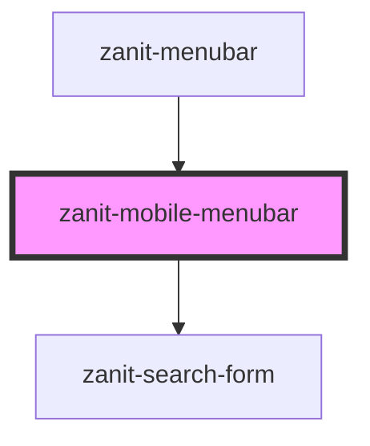

# zanit-mobile-menubar

<!-- Auto Generated Below -->

## Overview

Mobile menubar component.

## Properties

| Property      | Attribute      | Description                              | Type            | Default     |
| ------------- | -------------- | ---------------------------------------- | --------------- | ----------- |
| `currentPath` | `current-path` | IDs path of the current item.            | `string[]`      | `[]`        |
| `items`       | `items`        | Menubar items.                           | `MenubarItem[]` | `[]`        |
| `loading`     | `loading`      | Whether the menubar is loading the data. | `boolean`       | `false`     |
| `searchQuery` | `search-query` | Initial search query.                    | `string`        | `undefined` |

## Dependencies

### Used by

 - [zanit-menubar](..)

### Depends on

- [zanit-search-form](../search-form)

### Graph

----------------------------------------------

*Built with [StencilJS](https://stenciljs.com/)*
