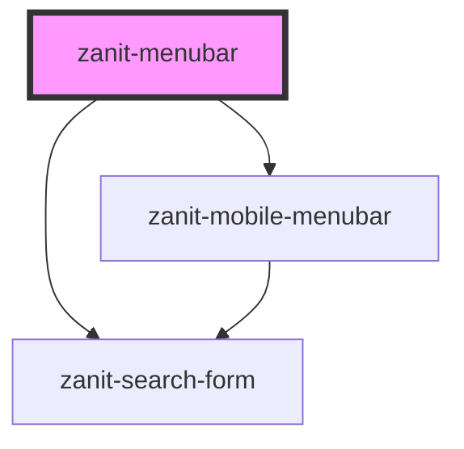

# zanit-menubar

<!-- Auto Generated Below -->

## Overview

Main menubar component. Each item can have a menu with subitems
When a main menubar item is the current active one, a sub-menubar is shown and each subitem can have a menu with subitems.

## Properties

| Property          | Attribute           | Description                                                                                                                                            | Type                                                       | Default     |
| ----------------- | ------------------- | ------------------------------------------------------------------------------------------------------------------------------------------------------ | ---------------------------------------------------------- | ----------- |
| `current`         | `current`           | Path of the current item.                                                                                                                              | `string`                                                   | `undefined` |
| `data`            | `data`              | The data to build the menu (as an array of `MenubarItem` or a JSON array) or the url to fetch to retrieve it.                                          | `MenubarItem[] \| Promise<MenubarItem[]> \| URL \| string` | `undefined` |
| `mouseOutTimeout` | `mouse-out-timeout` | Delay in milliseconds before closing the menu after a mouseout event. Useful to avoid immediate closing when the pointer briefly leaves the component. | `number`                                                   | `500`       |
| `searchQuery`     | `search-query`      | Initial search query.                                                                                                                                  | `string`                                                   | `undefined` |

## Dependencies

### Depends on

- [zanit-mobile-menubar](mobile-menubar)
- [zanit-search-form](search-form)

### Graph

----------------------------------------------

*Built with [StencilJS](https://stenciljs.com/)*
