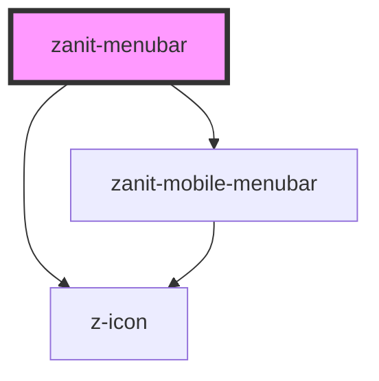

# zanit-menubar

<!-- Auto Generated Below -->

## Overview

Main menubar component. Each item can have a menu with subitems
When a main menubar item is the current active one, a sub-menubar is shown and each subitem can have a menu with subitems.

## Properties

| Property      | Attribute      | Description                                                                                                | Type                                                       | Default     |
| ------------- | -------------- | ---------------------------------------------------------------------------------------------------------- | ---------------------------------------------------------- | ----------- |
| `current`     | `current`      | ID of the current active item.                                                                             | `string`                                                   | `undefined` |
| `data`        | `data`         | The data to build the menu (as an array of `MenuItem` or a JSON array) or the url to fetch to retrieve it. | `MenubarItem[] \| Promise<MenubarItem[]> \| URL \| string` | `undefined` |
| `searchQuery` | `search-query` | Initial search query.                                                                                      | `string`                                                   | `undefined` |

## Events

| Event    | Description                        | Type                              |
| -------- | ---------------------------------- | --------------------------------- |
| `search` | Emitted on search form submission. | `CustomEvent<{ query: string; }>` |

## Dependencies

### Depends on

- [zanit-mobile-menubar](mobile-menubar)
- z-icon

### Graph

----------------------------------------------

*Built with [StencilJS](https://stenciljs.com/)*
