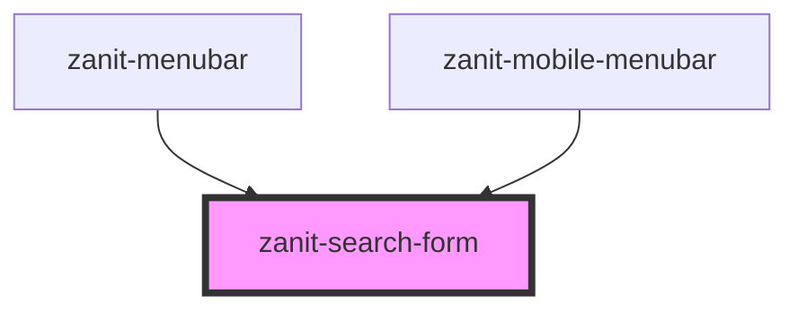

# search-form

<!-- Auto Generated Below -->

## Properties

| Property      | Attribute      | Description                                                           | Type     | Default     |
| ------------- | -------------- | --------------------------------------------------------------------- | -------- | ----------- |
| `area`        | `area`         | The currently active area (e.g. "SCUOLA", "UNIVERSITÀ", "DIZIONARI"). | `string` | `undefined` |
| `searchQuery` | `search-query` | Initial search query                                                  | `string` | `undefined` |

## Events

| Event         | Description                        | Type                                             |
| ------------- | ---------------------------------- | ------------------------------------------------ |
| `resetSearch` |                                    | `CustomEvent<void>`                              |
| `search`      | Emitted on search form submission. | `CustomEvent<{ query: string; area?: string; }>` |

## Dependencies

### Used by

 - [zanit-menubar](..)
 - [zanit-mobile-menubar](../mobile-menubar)

### Graph

----------------------------------------------

*Built with [StencilJS](https://stenciljs.com/)*
