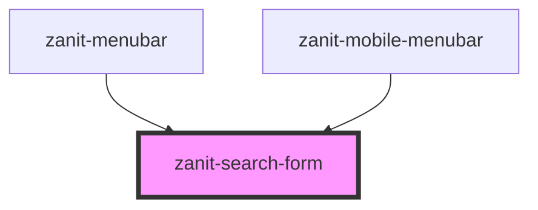

# search-form

<!-- Auto Generated Below -->

## Properties

| Property      | Attribute      | Description                                                             | Type                               | Default     |
| ------------- | -------------- | ----------------------------------------------------------------------- | ---------------------------------- | ----------- |
| `searchArea`  | `search-area`  | The currently active area (e.g. "SCUOLA", "UNIVERSITÀ", "DIZIONARI").   | `string`                           | `undefined` |
| `searchEnv`   | `search-env`   | Environment for which to retrieve the suggestions categories for search | `SearchEnv.PROD \| SearchEnv.TEST` | `undefined` |
| `searchQuery` | `search-query` | Initial search query                                                    | `string`                           | `undefined` |

## Events

| Event               | Description                           | Type                                                                                                                |
| ------------------- | ------------------------------------- | ------------------------------------------------------------------------------------------------------------------- |
| `resetSearch`       |                                       | `CustomEvent<void>`                                                                                                 |
| `search`            | Emitted on search form submission.    | `CustomEvent<{ query: string; area?: string; }>`                                                                    |
| `suggestionClicked` | Emitted when a suggestion is clicked. | `CustomEvent<{ label: string; url: string; user_query: string; query?: string; area?: string; subject?: string; }>` |

## Dependencies

### Used by

 - [zanit-menubar](..)
 - [zanit-mobile-menubar](../mobile-menubar)

### Graph

```mermaid
graph TD;
  zanit-menubar --> zanit-search-form
  zanit-mobile-menubar --> zanit-search-form
  style zanit-search-form fill:#f9f,stroke:#333,stroke-width:4px
```

----------------------------------------------

*Built with [StencilJS](https://stenciljs.com/)*
